# Solana Memes Platform - Complete User Flow Guide

## 🏗️ **Platform Architecture Overview**

```
┌─────────────────────────────────────────────────────────────────────────────┐
│                           SOLANA MEMES PLATFORM                            │
├─────────────────────────────────────────────────────────────────────────────┤
│  🏛️  PROTOCOL TEAM  │  🎨  CREATORS  │  👥  USERS  │  💎  STAKERS  │  🏆  WHALES  │
└─────────────────────────────────────────────────────────────────────────────┘
```

## 🏛️ **Protocol Team Flow**

### **Phase 1: Platform Setup**
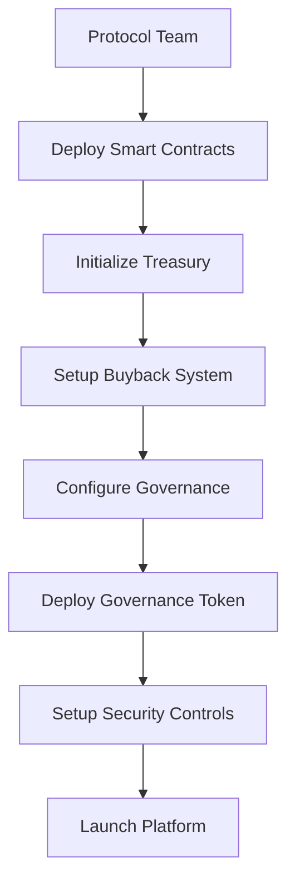

### **Phase 2: Ongoing Management**
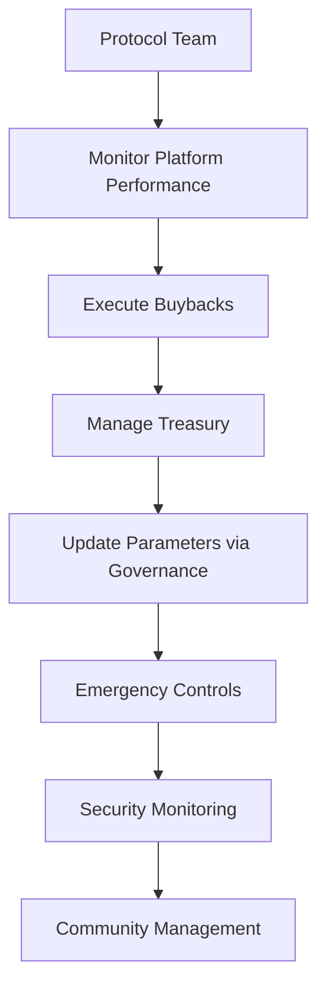

### **Key Responsibilities:**
- **Platform Deployment**: Deploy and configure all smart contracts
- **Treasury Management**: Manage USDC reserves and token distribution
- **Buyback Execution**: Monitor and execute automated buybacks
- **Governance Oversight**: Participate in governance decisions
- **Security Management**: Monitor and respond to security threats
- **Community Building**: Foster community growth and engagement

---

## 🎨 **Creator Flow**

### **Phase 1: Creator Registration**
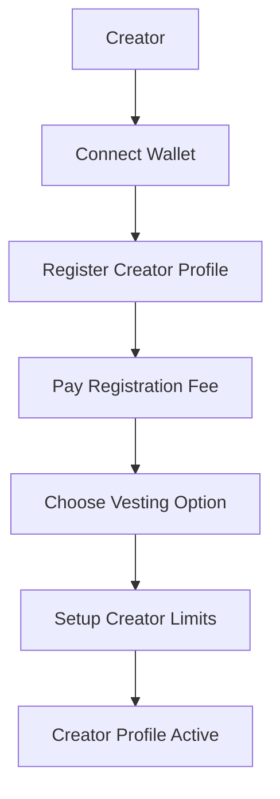

### **Phase 2: Token Creation**
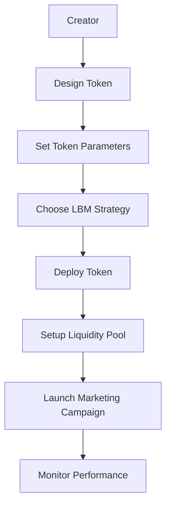

### **Phase 3: Ongoing Management**
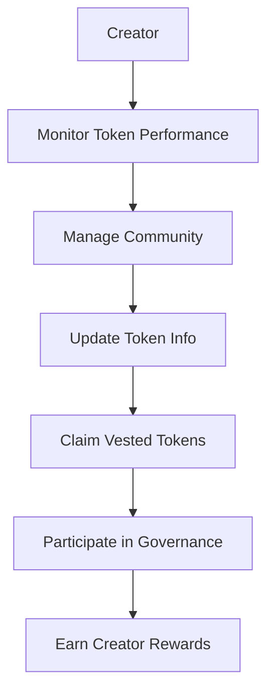

### **Creator Benefits:**
- **Token Creation**: Create and launch memecoins with anti-rug protection
- **Vesting System**: Lock tokens with scheduled release to build trust
- **Creator Rewards**: Earn from successful token performance
- **Community Tools**: Built-in community management features
- **Governance Rights**: Participate in platform governance

---

## 👥 **Small Users Flow**

### **Phase 1: Platform Entry**
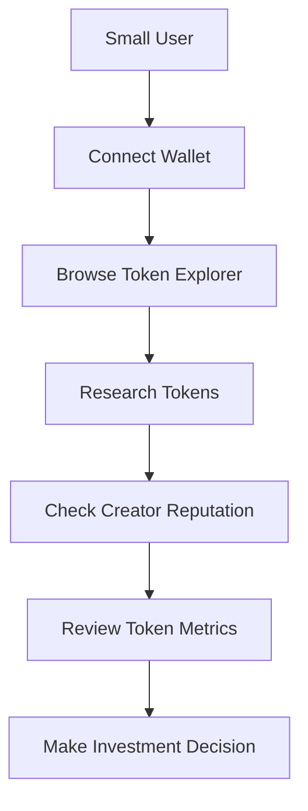

### **Phase 2: Token Participation**
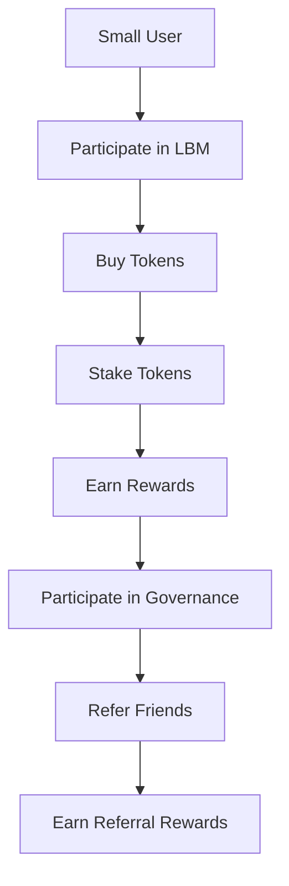

### **Phase 3: Long-term Engagement**
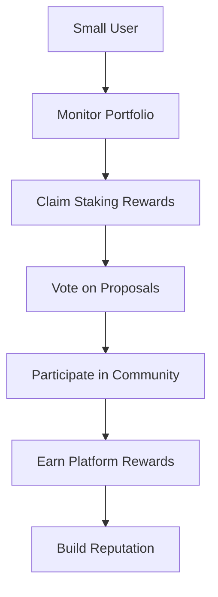

### **Small User Benefits:**
- **Safe Investment**: Anti-rug protection and creator verification
- **Staking Rewards**: Earn from staking tokens and platform fees
- **Governance Rights**: Vote on platform proposals
- **Referral Program**: Earn rewards for bringing new users
- **Community Access**: Join token communities and discussions

---

## 🏆 **Whale Users Flow**

### **Phase 1: Strategic Entry**
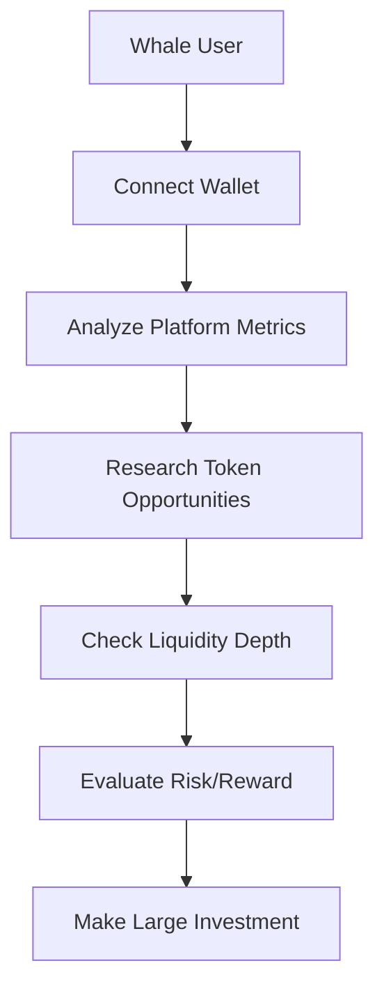

### **Phase 2: Large-Scale Participation**
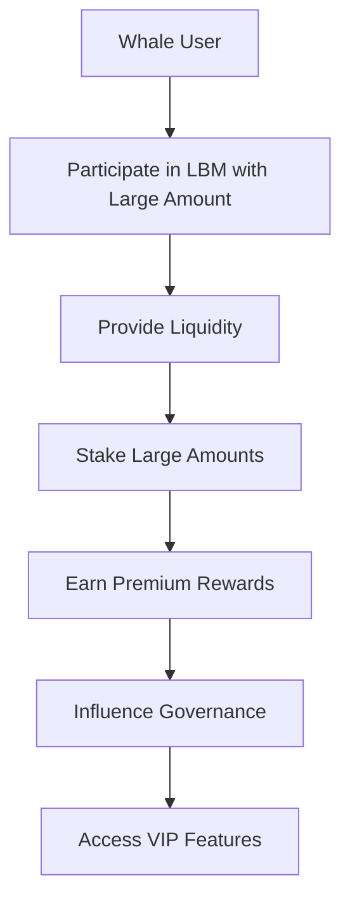

### **Phase 3: Platform Influence**
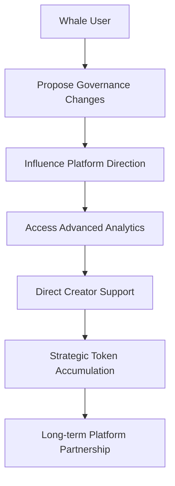

### **Whale User Benefits:**
- **Premium Rewards**: Higher staking rewards and fee sharing
- **Governance Influence**: Significant voting power in decisions
- **VIP Access**: Advanced features and early access to new tokens
- **Direct Creator Support**: Ability to support creators directly
- **Strategic Partnerships**: Collaborate with platform team

---

## 💎 **SMEME Token Stakers Flow**

### **Phase 1: Token Acquisition**
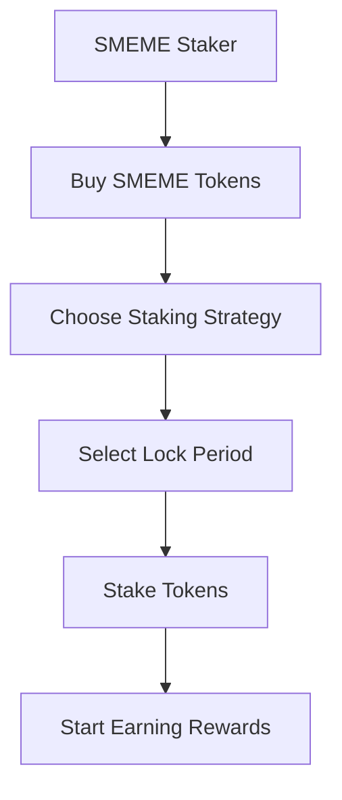

### **Phase 2: Staking Benefits**
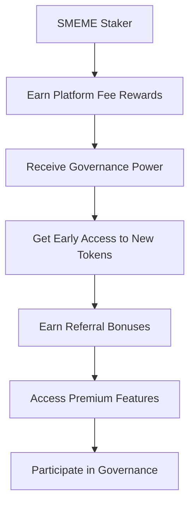

### **Phase 3: Long-term Engagement**
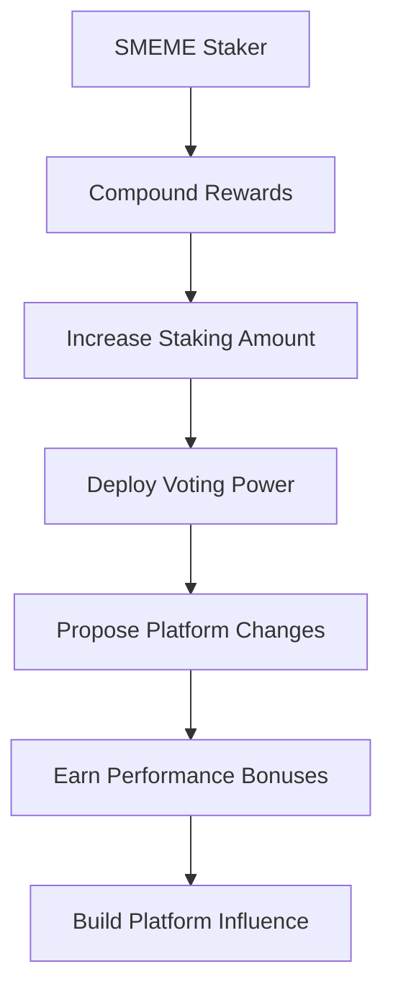

### **SMEME Staking Benefits:**
- **Platform Fee Sharing**: 55% of all platform fees distributed to stakers
- **Governance Power**: Voting rights on all platform proposals
- **Early Access**: Priority access to new token launches
- **Premium Features**: Access to advanced platform features
- **Referral Rewards**: Earn bonuses for bringing new users
- **Performance Bonuses**: Additional rewards for active participation

---

## 🏆 **Native Token (SMEME) Stakers Flow**

### **Phase 1: Governance Token Staking**
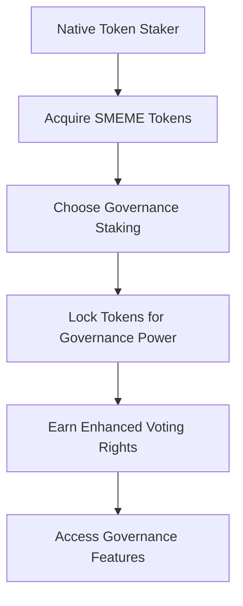

### **Phase 2: Governance Participation**
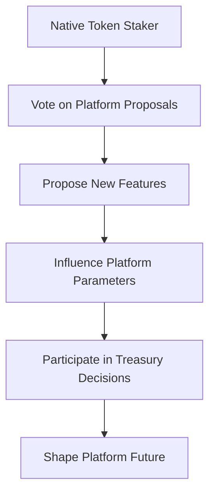

### **Phase 3: Governance Rewards**
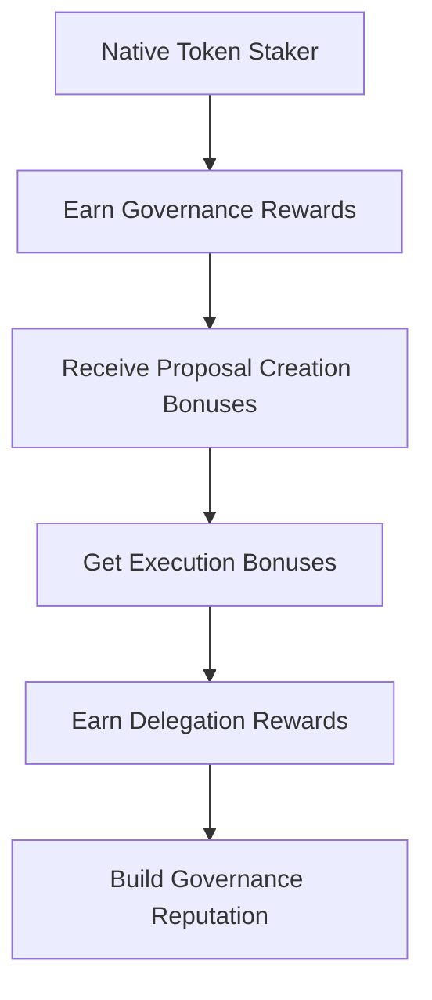

### **Native Token Staking Benefits:**
- **Enhanced Voting Power**: Increased influence in governance decisions
- **Proposal Creation**: Ability to create and submit proposals
- **Execution Bonuses**: Rewards for successful proposal execution
- **Delegation Rewards**: Earn from delegating voting power
- **Platform Control**: Direct influence over platform direction
- **Treasury Access**: Participate in treasury spending decisions

---

## 🔄 **Complete Platform Flow**

### **Token Lifecycle**
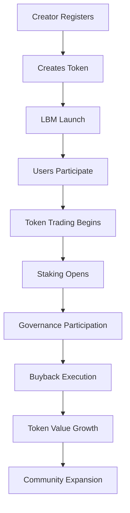

### **Revenue Distribution**
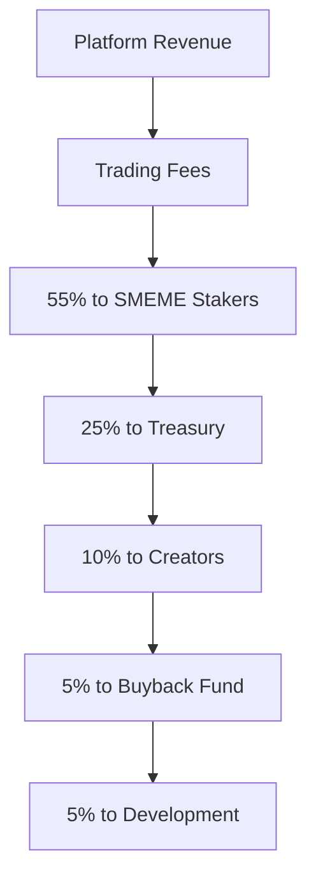

### **Governance Flow**
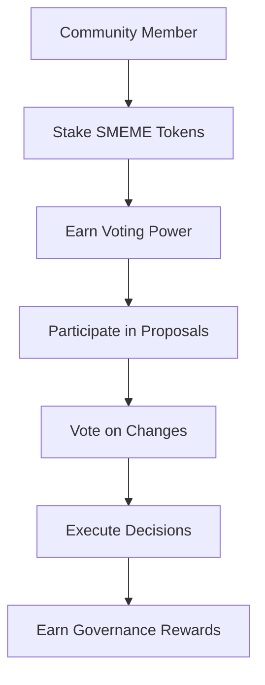

---

## 📊 **User Type Comparison**

| User Type | Investment Size | Benefits | Governance Power | Platform Influence |
|-----------|----------------|----------|------------------|-------------------|
| **Protocol Team** | N/A | Platform ownership, fee revenue | Full control | Maximum |
| **Creators** | Variable | Token success, creator rewards | Medium | High |
| **Small Users** | <$1K | Safe investment, staking rewards | Low | Low |
| **Whale Users** | >$10K | Premium rewards, VIP access | High | High |
| **SMEME Stakers** | Variable | Fee sharing, governance rights | Medium | Medium |
| **Native Token Stakers** | Variable | Enhanced governance, platform control | High | High |

---

## 🎯 **Key Success Metrics**

### **For Each User Type:**

#### **Protocol Team**
- Platform adoption rate
- Total value locked (TVL)
- Revenue generation
- Community growth

#### **Creators**
- Token success rate
- Community engagement
- Revenue from token performance
- Platform reputation

#### **Small Users**
- Investment returns
- Staking rewards earned
- Community participation
- Referral success

#### **Whale Users**
- Large-scale returns
- Platform influence
- Strategic partnerships
- Governance impact

#### **SMEME Stakers**
- Fee sharing rewards
- Governance participation
- Platform growth benefits
- Long-term value appreciation

#### **Native Token Stakers**
- Governance rewards
- Platform control
- Proposal success rate
- Community leadership

---

## 🚀 **Platform Growth Strategy**

### **Phase 1: Foundation (Months 1-3)**
- Protocol team setup and deployment
- Initial creator onboarding
- Small user acquisition
- Basic staking implementation

### **Phase 2: Growth (Months 4-6)**
- Whale user attraction
- Advanced staking features
- Governance token launch
- Community expansion

### **Phase 3: Maturity (Months 7-12)**
- Full governance implementation
- Advanced features rollout
- Cross-chain expansion
- Ecosystem partnerships

### **Phase 4: Scale (Year 2+)**
- Multi-chain deployment
- Advanced analytics
- AI-driven features
- Global expansion

---

## ✅ **Success Indicators**

### **Platform Health**
- **TVL Growth**: Increasing total value locked
- **User Retention**: High user engagement rates
- **Token Success**: Successful token launches
- **Community Growth**: Expanding user base

### **Economic Sustainability**
- **Revenue Generation**: Consistent fee income
- **Buyback Success**: Effective token buybacks
- **Staking Participation**: High staking rates
- **Governance Activity**: Active community participation

### **Security & Trust**
- **No Rug Pulls**: Zero successful rug pulls
- **Security Audits**: Regular security assessments
- **Community Trust**: High user confidence
- **Transparency**: Open and verifiable operations

**This comprehensive flow ensures all user types have clear paths to success and value creation within the Solana Memes ecosystem!** 🚀
